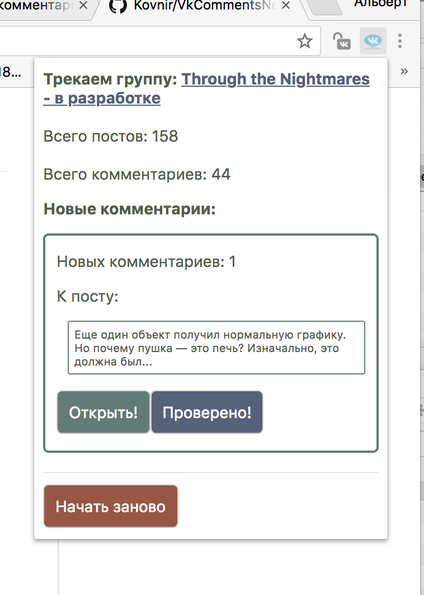

## Треккинг комментариев для групп Вконтакте (Chrome extention)

Каждые 30 секунд расширение опрашивает сервер vk.com и присылает уведомление в случае появления новых комментариев.

Так же выводит список новых с момента установки расширения комментариев с возможностью быстро открыть пост. По нажатию на кнопку "Проверено", пост с новыми комментариями удаляется из списка.

<a href="https://youtu.be/VXwDJo72EEI" target="_blank">Youtube видео с примерои моей группы</a>

<a href="https://chrome.google.com/webstore/detail/%D0%BF%D1%80%D0%BE%D1%81%D0%BB%D1%83%D1%88%D0%BA%D0%B0-%D0%BA%D0%BE%D0%BC%D0%BC%D0%B5%D0%BD%D1%82%D0%B0%D1%80%D0%B8%D0%B5%D0%B2-%D0%B4%D0%BB/ommpjejbgmpbmbjfhgchgdnenchckohm?hl=ru" target="_blank">Ссылка на расширение в магазиене расширений Chrome</a>
